<div align="center">

# SmartCache
  


**💰 Save Thousands on API Costs | ⚡ 10x Faster Workflows | 🧠 Intelligent Caching**

[](https://discord.gg/N9mVvxRXyH)
[](https://www.npmjs.com/package/n8n-nodes-smartcache)
[](LICENSE)
[](https://www.npmjs.com/search?q=keywords:n8n-community-node-package)
[](https://github.com/skadaai/n8n-nodes-smartcache)
[](https://github.com/sponsors/zvictor)

</div>

## Table of Contents

- [💡 The Problem SmartCache Solves](#-the-problem-smartcache-solves)
- [🚀 Key Benefits](#-key-benefits)
- [💰 High-Value Use Cases](#-high-value-use-cases)
- [📊 Performance Impact](#-performance-impact)
- [🏗️ How It Works](#-how-it-works)
- [📥 Installation](#-installation)
- [⚙️ Configuration](#%EF%B8%8F-configuration)
- [📚 Usage Examples](#-usage-examples)
- [🔧 Advanced Configuration](#-advanced-configuration)
- [🛠️ Troubleshooting](#-troubleshooting)
- [📈 Monitoring & Analytics](#-monitoring-analytics)
- [🤝 Contributing](#-contributing)
- [📄 License](#-license)
- [🆘 Support](#-support)
- [🔗 Related](#-related)

## 💡 The Problem SmartCache Solves

**Stop burning money on repeated API calls!** Whether you're processing documents with GPT-5, generating videos with Veo3 or images with Imagen-4, or fetching data from expensive APIs, SmartCache dramatically reduces costs and execution time by intelligently caching results.

### 💸 Real Cost Savings

- **LLM API Calls**: Save $100s-$1000s monthly on GPT-5, Claude, Gemini calls
- **Media Generation**: Avoid repeated Imagen-4, Midjourney, Stable Diffusion costs  
- **File Processing**: Cache expensive PDF parsing, OCR, audio transcription
- **External APIs**: Prevent redundant calls to third-party services
- **Binary Operations**: Cache processed images, videos, documents

## 🚀 Key Benefits

- 🚀 **Automatic Hash Generation**: SHA-256 based cache keys from input data
- 📦 **Universal Compatibility**: Works with any data type - JSON, binary files, API responses
- ⏰ **TTL Support**: Configurable cache expiration (hours or infinite)
- 🎯 **Selective Caching**: Choose specific fields for cache key generation
- 💾 **Persistent Storage**: File-based caching survives workflow restarts
- 🔄 **Dual Input/Output**: Separate cache check and cache write operations
- 🗂️ **Node-Specific Isolation**: Each node instance has separate cache
- 📊 **Batch & Individual Modes**: Process items individually or as batches

## 💰 High-Value Use Cases

### 🧠 LLM & AI Operations
**Problem**: GPT-5 costs $0.03/1K input tokens. Processing 1000 articles = $30+ per run.  
**Solution**: 90% cache hit rate = $3 instead of $30 per execution.


### 🖼️ Media Generation & Processing  
**Problem**: Imagen-4 costs $0.06-0.08 per image. Veo3 starts at $4 per call. Stable Diffusion API costs add up.  
**Solution**: Cache generated media, avoid regenerating identical prompts.

### 📄 Document Processing
**Problem**: OCR, PDF parsing, audio transcription are expensive and slow.  
**Solution**: Cache processed results, instantly return for duplicate files.

### 🌐 External API Calls
**Problem**: Third-party APIs have rate limits and costs per request.  
**Solution**: Cache API responses, reduce external dependencies.

## 📊 Performance Impact

Performance gains are directly tied to the cache hit rate and the latency of the original operation. Below are representative results from real-world scenarios:

| Use Case                 | Typical Cache Hit Rate | Cost Reduction | Execution Time                 |
|--------------------------|------------------------|----------------|--------------------------------|
| LLM Article Processing   | 85%                    | ~6.7x          | From seconds to milliseconds   |
| Generative AI Media      | 70%                    | ~33x           | From minutes to milliseconds   |
| PDF/Document OCR         | 95%                    | 20x            | From ~30s per page to <50ms    |
| Frequent API Polling     | 90%                    | 10x            | From seconds to milliseconds   |
| Audio Transcription      | 80%                    | 5x             | From seconds to milliseconds   |

## 🏗️ How It Works

SmartCache uses a sophisticated dual input/output design:

```mermaid
graph TD
    A[Input Data] --> B[SmartCache Node]
    B --> C{Cache Hit?}
    C -->|Yes| D[Cache Hit Output<br/>⚡ Instant Result]
    C -->|No| E[Cache Miss Output<br/>🔄 Needs Processing]
    E --> F[Expensive Operation<br/>💰 API/LLM/Processing]
    F --> G[SmartCache Write Input]
    G --> H[Cache Storage<br/>💾 For Future Use]
    G --> I[Final Output]
    D --> I
```



### Cache Key Generation
- **SHA-256 hashing** of input data ensures consistent, secure keys
- **Node ID inclusion** prevents cache collisions between different nodes
- **Selective fields** allow fine-tuned caching strategies
- **Sorted keys** guarantee deterministic hashing

## 📥 Installation

### [Within n8n using the GUI](https://docs.n8n.io/integrations/community-nodes/installation/gui-install/):

1. Go to **Settings > Community Nodes**.
2. Select **Install**.
3. Enter `n8n-nodes-smartcache` in the `npm package name` field.
4. Agree to the risks of using community nodes.
5. Select **Install**.


### [For self-hosted n8n installations](https://docs.n8n.io/integrations/community-nodes/installation/manual-install/):

```bash
npm install n8n-nodes-smartcache
```

### For n8n Cloud users:
This node is not yet verified for n8n Cloud. Please use a self-hosted n8n instance.

## ⚙️ Configuration

### Node Parameters

| Parameter | Type | Default | Description |
|-----------|------|---------|-------------|
| **S3 Bucket** | String | "" | Bucket where cache objects are stored |
| **Path Prefix** | String | `$smartcache` | Prefix used for keys inside the bucket |
| **Batch Mode** | Boolean | false | Whether to process all input items as a single unit |
| **Force Miss** | Boolean | false | Whether to force cache miss and regenerate data |
| **Cache Key Fields** | String | "" | Comma-separated fields for cache key (empty = all fields) |
| **TTL (Hours)** | Number | 24 | Cache expiration time (0 = infinite) |

Note on persistence:
- SmartCache requires the built-in "S3" credential and persists to your S3-compatible bucket using the provided Path Prefix.
  - For self-hosted or S3-compatible services with self-signed certificates, enable "Ignore SSL" in your S3 credential, or use an HTTP endpoint if appropriate.

### Input/Output Design

**Inputs:**
1. **Input** - Data to check against cache
2. **Write** - Data to write to cache (from expensive operations)

**Outputs:**
1. **Cache Hit** - Data found in cache (instant, free)
2. **Cache Miss** - Data not found (needs expensive processing)

## 📚 Usage Examples

Below are practical, complete examples that you can import directly into n8n. These examples use only built-in n8n nodes.

### Example 1: Caching LLM Text Summarization

**Scenario**: You have text articles that you need to summarize using an LLM. Since LLM calls are expensive and deterministic, caching the results for identical texts saves money and speeds up reruns.

**Logic**:
1.  **Sample Articles**: A `Code` node provides the input text. In a real workflow, this could be an RSS feed, an API call, or a database query.
2.  **SmartCache (Check)**: The node generates a hash from the `article` field and checks if a cached result exists.
3.  **Cache Miss**: If the text is new, it's sent to the OpenAI node for summarization.
4.  **SmartCache (Write)**: The summary from OpenAI is passed to the `Write` input of the SmartCache node and saved.
5.  **Cache Hit**: If the text has been summarized before, the result is returned instantly from the cache.


[▶️ Download Workflow File](workflows/text_summarization.json)


---

### Example 2: Caching Image Generation

**Scenario**: You are generating images using DALL-E based on specific prompts and styles. Re-running the same prompt should not cost you another API credit or take extra time.

**Logic**:
1.  **Image Prompts**: A `Code` node provides a list of prompts and styles.
2.  **SmartCache (Check)**: The node generates a hash from the combination of the `prompt` and `style` fields to uniquely identify each image request.
3.  **Cache Miss**: If this prompt/style combination is new, it's sent to the OpenAI DALL-E node.
4.  **SmartCache (Write)**: The generated image data from OpenAI is saved to the cache.
5.  **Cache Hit**: If an identical prompt/style is requested again, the cached image is returned instantly.


[▶️ Download Workflow File](workflows/image_generation.json)


---

### Example 3: Caching Dynamic API Calls in a Loop

**Scenario**: A common pattern is to fetch a list of items, then loop through that list to fetch detailed information for each item. This can result in hundreds of API calls, which is a perfect use case for caching.

**Logic**:
1.  **Get All Posts**: Fetches a list of 100 sample posts.
2.  **Loop Over Posts**: The `SplitInBatches` node processes each item from the list individually.
3.  **SmartCache (Check)**: For each item, the cache is checked using the post's `id` as the unique key.
4.  **Cache Miss**: If the post's details are not in the cache, an `HTTP Request` is made to fetch that specific post.
5.  **SmartCache (Write)**: The details of the new post are written to the cache.
6.  **Cache Hit**: If the post was fetched on a previous run, its details are returned instantly from the cache, saving an API call.


[▶️ Download Workflow File](workflows/api_caching.json)


## 🔧 Advanced Configuration

### Cache Key Generation

SmartCache generates unique cache keys using:

- **Node ID**: Ensures cache isolation between different node instances
- **Input Data**: SHA-256 hash of the input data (sorted for consistency)
- **Selected Fields**: Only specified fields if `cacheKeyFields` is set

### Batch vs Individual Mode

**Individual Mode (default)**:
- Each input item processed separately
- Fine-grained caching control
- Mixed cache hits/misses possible

**Batch Mode**:
- All input items as single unit
- All-or-nothing caching
- Better for related data sets

### TTL Management

- **Positive values**: Cache expires after specified hours
- **Zero**: Cache never expires

## 🛠️ Troubleshooting

### Common Issues

**High API costs continue:**
- Check cache hit rates in logs
- Verify cache key fields are appropriate
- Ensure input data is consistent

**Cache not working:**

- When using S3, ensure the bucket exists and your IAM user has `s3:HeadObject`, `s3:GetObject`, and `s3:PutObject` permissions for the chosen prefix
- Check that input data structure is consistent
- Ensure node ID remains stable across executions

**High memory usage:**

- Consider using `cacheKeyFields` to limit cache key data
- Implement cache cleanup for old files
- For persistent S3 caches, consider enabling TTL to limit object growth

**Permission errors:**

- Ensure S3 credentials are valid and region/endpoint are correct
- Use a distinct prefix per environment or workflow to avoid collisions

## 📈 Monitoring & Analytics

SmartCache provides detailed logging:

```
[SmartCache] Generated cache metadata: {cacheKey: "abc123", cachePath: "$smartcache/abc123.cache"}
[SmartCache] Cache hit: {cacheKey: "abc123", cacheAge: 2.5}
[SmartCache] Cache miss: {cacheKey: "def456", reason: "File not found"}
[SmartCache] Finished processing: {totalItems: 10, cacheHits: 8, cacheMisses: 2}
```

## 🤝 Contributing

Contributions are welcome! Please:

1. Fork the repository
2. Create a feature branch
3. Make your changes
4. Add tests if applicable
5. Submit a pull request

## 📄 License

Mozilla Public License 2.0 - see [LICENSE](LICENSE) file for details.

## 🆘 Support

- 🐛 **Issues**: [GitHub Issues](https://github.com/skadaai/n8n-nodes-smartcache/issues)
- 💬 **Community**: [Discord Server](https://discord.gg/N9mVvxRXyH)

## 🔗 Related

- [n8n Community Nodes](https://docs.n8n.io/integrations/community-nodes/installation/)

---

<div align="center">

**⭐ Star this repo if SmartCache saves you money! ⭐**

*Made with ❤️ for the n8n community*

</div>
